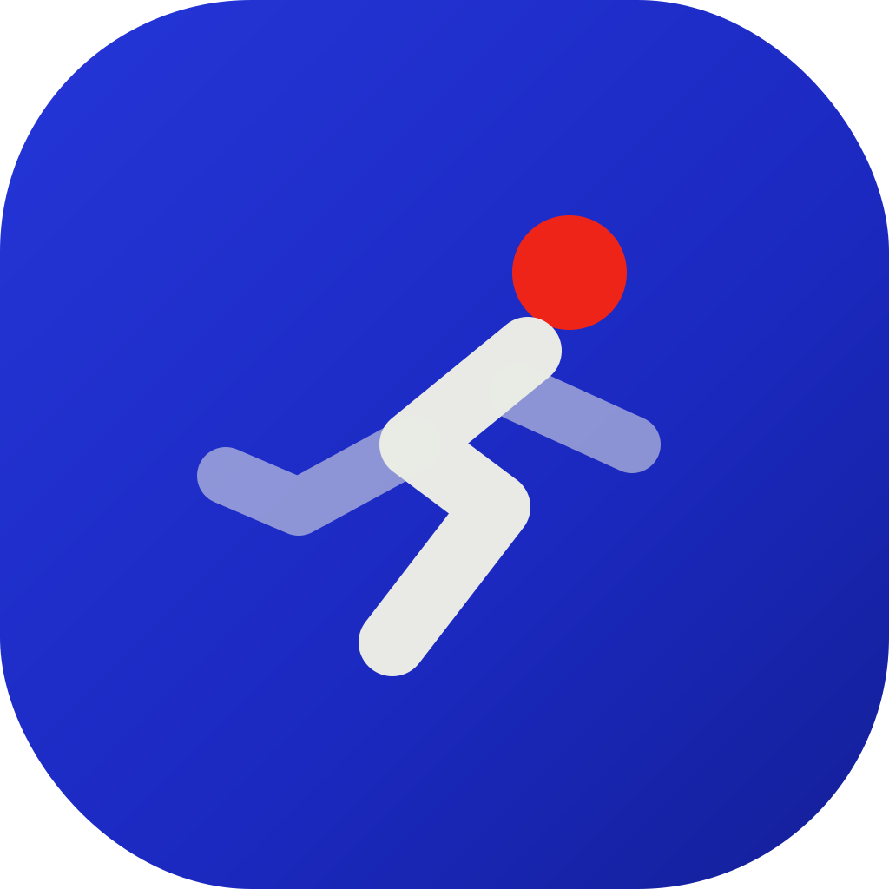

<p align="center">
  
</p>

<h1 align="center">Stride</h1>

<p align="center">AI-powered running coach — Strava sync, progression analysis, generative UI</p>

<p align="center">
  <a href="https://stride-ochre-five.vercel.app"><strong>Live → stride-ochre-five.vercel.app</strong></a> ·
  <a href="../../issues">Issues</a> ·
  <a href="./docs/architecture.md">Architecture</a>
</p>

---

## What is Stride?

A Next.js 16 running coach platform that connects to Strava, visualizes training data with rich dashboards, and generates personalized insights via **generative AI** — the AI calls typed tools that render pre-defined React components, not plain text.

It's designed to replace a manual running-coach workflow with an intelligent, data-driven platform.

## Tech Stack

| Layer | Technology |
|---|---|
| Framework | Next.js 16 (App Router, Turbopack) |
| Language | TypeScript (strict) |
| Styling | Tailwind CSS + shadcn/ui |
| AI | Vercel AI SDK (streamObject, typed tools) |
| Database | Drizzle ORM + Neon (Vercel Postgres) |
| Auth | NextAuth.js v5 |
| Charts | Recharts |
| Testing | Vitest (845 tests) |
| CI/CD | Vercel (automatic deploys) |
| LLM Agents | Hermes (Orchestrator) + Claude Code (Opus, Fable) |

## Architecture

### Generative UI

Instead of streaming text, the AI endpoint (`app/api/ai/analyze`) streams typed tool calls as NDJSON. Each tool maps to a validated React component:

| Tool | Component | Purpose |
|---|---|---|
| `insight-card` | `InsightCard` | Severity-dotted observations |
| `trend-callout` | `TrendCallout` | Directional deltas with sparklines |
| `workout-recommendation` | `WorkoutRecommendation` | Suggested next run |
| `metric-comparison` | `MetricComparison` | Week-over-week stats |
| `coach-insight` | `CoachInsight` | Personalized coaching messages |

### Key Design Decisions

- **Generative UI over plain text** — AI calls typed tools, pre-defined components render
- **Server-side AI only** — API keys never reach the browser
- **Drizzle over Prisma** — SQL-first, edge-compatible
- **NextAuth over Clerk** — Free, demonstrates OAuth competence
- **AES-256-GCM encrypted tokens** — Per-row IVs for Strava OAuth tokens
- **Heuristic fallback** — AI analysis works without API key for demo/portfolio

### Landing & Brand

- **Velkommen landing page** ([#119](../../issues/119)) — public visitors get a branded landing page with live preview widgets; the demo dashboard lives at `/?demo=1`
- **AI coach teaser** ([#121](../../issues/121)) — coach analysis rendered as a typewriter loop on the landing page
- **Open Graph social card** ([#120](../../issues/120)) — `app/opengraph-image.tsx` with Bricolage wordmark + serif-italic tagline
- **Cobalt Glass design system** — light "silver paper" theme with liquid-glass surfaces: `components/cobalt/` (UI) + `lib/cobalt/` (view-models), tokens in `app/globals.css`

### AI-First Workflow

```
Hermes (Orchestrator)     →  Planlægger, verificerer, håndterer issues
Claude Code (Opus/Fable)  →  Implementerer features via GitHub Issues
```

## Getting Started

```bash
git clone https://github.com/benneknudsen/stride.git
cd stride
cp .env.example .env.local
npm install
npm run db:migrate
npm run dev
```

Required env vars: `DATABASE_URL`, `AUTH_SECRET`, `ENCRYPTION_KEY` (see `.env.example` for all).

## Project Status

**✅ Live på Vercel → [stride-ochre-five.vercel.app](https://stride-ochre-five.vercel.app)**

### ✅ Phase 1 — Complete

- [x] Architecture + project scaffold
- [x] Database schema (Drizzle + PostgreSQL)
- [x] NextAuth v5 foundation
- [x] Strava PKCE OAuth + encrypted token storage
- [x] Activity sync pipeline
- [x] Dashboard (weekly volume, pace distribution, zone breakdown)
- [x] Activity detail page
- [x] AI analysis with generative UI (streamObject + 4 typed tools)
- [x] Training plan dashboard (committed plan, latest run, last 5, next run)
- [x] Deploy to Vercel + Neon Postgres
- [x] 845 tests

### ✅ Phase 2 — Coach Intelligence — Complete

- [x] [#30 Progression metrics engine](../../issues/30) — pace/HR trends, training load
- [x] [#31 Coach rule engine](../../issues/31) — 155 bpm, 48h buffer, phases
- [x] [#32 Workout recommender](../../issues/32) — next workout engine
- [x] [#33 Coach insight cards](../../issues/33) — AI-generated coaching messages
- [x] [#34 Coach dashboard](../../issues/34) — unified coaching view

## Author

**Benjamin Knudsen** — [GitHub](https://github.com/benneknudsen)

*Built with Hermes + Claude Code*
