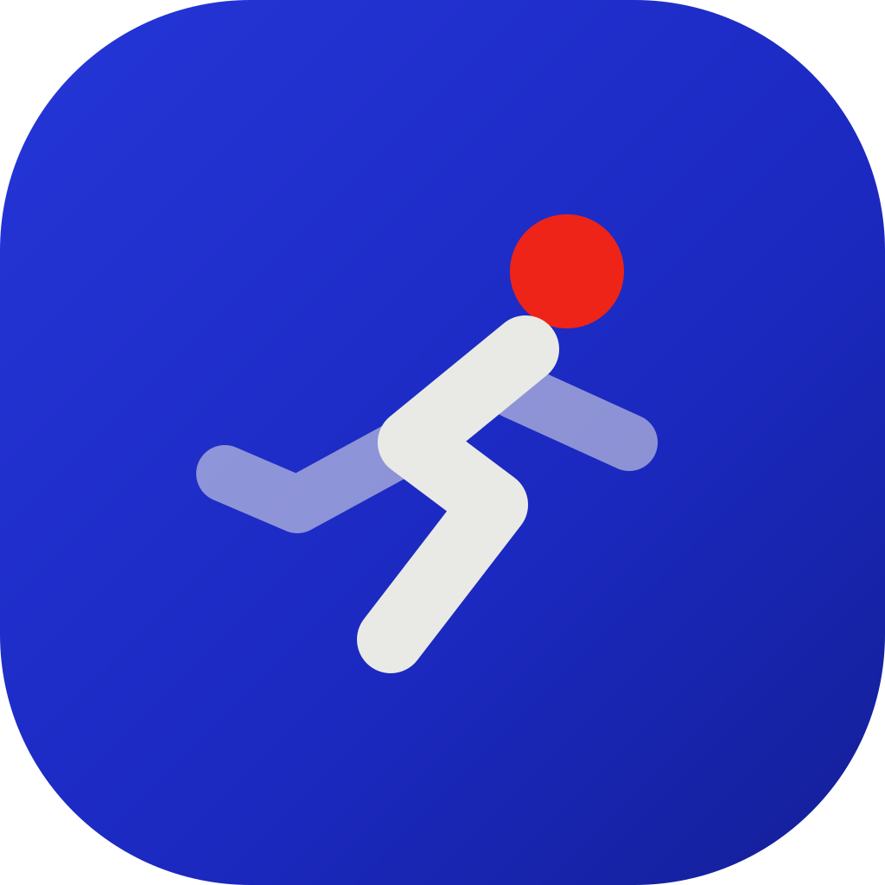

  

<h1 align="center">Stride</h1>

AI-powered running coach — Strava sync, progression analysis, generative UI

  <a href="https://stride-run.club"><strong>Live → stride-run.club</strong></a>

---

## What is Stride?

A Next.js running coach platform that connects to Strava, visualizes training data with rich dashboards, and generates personalized insights via **generative AI** — the AI calls typed tools that render React components, not plain text.

## Tech Stack

| Layer | Technology |
|---|---|
| Framework | Next.js 16 (App Router, Turbopack) |
| Language | TypeScript (strict) |
| Styling | Tailwind CSS + shadcn/ui |
| AI | Vercel AI SDK (streamObject, typed tools) |
| Database | Drizzle ORM + Neon Postgres |
| Auth | NextAuth.js v5 |
| Charts | Recharts |
| Testing | Vitest (887 tests) |
| CI/CD | Vercel (automatic deploys) |

## Architecture

### Generative UI

Instead of streaming text, the AI endpoint streams typed tool calls as NDJSON. Each tool maps to a validated React component:

| Tool | Component | Purpose |
|---|---|---|
| `insight-card` | `InsightCard` | Severity-dotted observations |
| `trend-callout` | `TrendCallout` | Directional deltas with sparklines |
| `workout-recommendation` | `WorkoutRecommendation` | Suggested next run |
| `metric-comparison` | `MetricComparison` | Week-over-week stats |
| `coach-insight` | `CoachInsight` | Personalized coaching messages |

The **coach chat** (`/api/ai/chat`) applies the same idea to a conversation. Each NDJSON line is a discriminated `ChatReply`: a `text` fragment (a token of the streamed answer) or a `block` fragment (a piece of generative UI). When the model calls a tool, the route validates that tool's output with zod and streams it as a block — so a card's numbers come from the rule engine, never the model's free text, and can't be fabricated. Text and blocks interleave in a single answer, and the prose still streams token by token beside the cards.

| Tool | Block → Component | Purpose |
|---|---|---|
| `getRecentActivities` | `ActivityCard` | Clickable run card → the activity's detail page (`activityRoute(id)`) |
| `recommendWorkout` | `WorkoutCard` | The recommended next session as a card, not just prose |

A line with no `type` field is treated as text, so older stream formats keep rendering unchanged.

### Design Decisions

- **Generative UI over plain text** — typed tool calls rendered by pre-defined components
- **Server-side AI only** — API keys never reach the browser
- **Drizzle over Prisma** — SQL-first, edge-compatible
- **AES-256-GCM encrypted tokens** — per-row IVs for OAuth tokens
- **Heuristic fallback** — AI analysis works without API key

### Design System

Cobalt Glass — a light "silver paper" theme with liquid-glass surfaces. Custom component library (`components/cobalt/`) + view-models (`lib/cobalt/`), with branded typography (Bricolage Grotesque, Instrument Sans/Serif) and an Open Graph social card.

## Status

Live in production at **[stride-run.club](https://stride-run.club)**, deployed on Vercel with Neon Postgres.

## Author

**Benjamin Knudsen** — [GitHub](https://github.com/benneknudsen)
